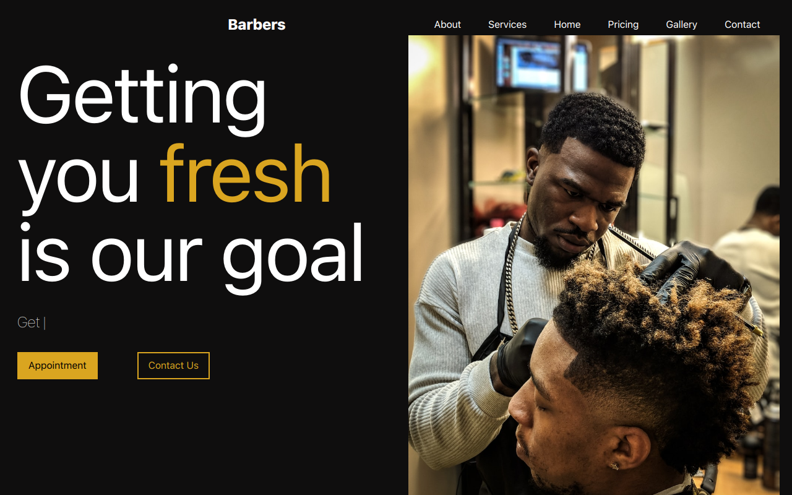

# Barber Website Landing Page



A responsive landing page for a personal barber website built using React.js, Tailwind CSS, and HTML. This landing page showcases a modern and sleek design, providing users with information about the barber shop and a call-to-action to book appointments.

## Table of Contents

- [Demo](#demo)
- [Features](#features)
- [Installation](#installation)
- [Usage](#usage)

## Demo

You can view a live demo of the website [here](https://mybarberapp.vercel.app/).

## Features

- Modern and sleek design
- Responsive layout for different screen sizes
- Booking feature to schedule appointments
- Interactive and engaging user experience

## Installation

To run this project locally, follow these steps:

1. Clone the repository:

   ```bash
   git clone https://github.com/Timz-creator/mybarberapp
   ```

## Usage

The landing page provides visitors with information about the barber shop, including the about section, pricing section, working hours and appointment section. The booking features allows user to select a preferred time and barber for their appointment. The page is optimized for different devices, ensuring a seamless user experience across desktop and mobile devices.

To customize the content and styling of the landing page, you can modify the corresponding components and stylesheets in the project. Tailwind CSS utility classes are used to quickly style the components, and React.js provides the dynamic behaviour.
You're welcome to adapt this project to your own personal barber webiste and make it unique to your branding.
